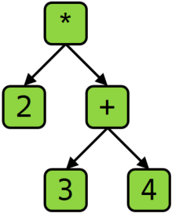

# Задание по программированию: Дерево выражений
В этой задаче мы воспользуемся умным указателем `unique_ptr` для управления временем жизни дерева полиморфных объектов. А конкретнее, будем работать с деревом арифметического выражения. Узлами дерева будут числа и операции.

Например, выражение "2*(3+4)" будет представлено вот таким деревом:



В программе узлы дерева представляются объектами типов, унаследованных от интерфейса Expression, который объявлен в файле Common.h. У интерфейса есть два метода:
* `Evaluate()` возвращает численное значение выражения. Для нашего примера это будет 14.
* `ToString()` форматирует выражение как строку. Для простоты реализации, чтобы не учитывать приоритеты операций, каждый узел берётся в скобки. То есть для нашего примера этот метод вернёт "(2)*((3)+(4))".

Так как `Expression` — это абстрактный класс, работать с ним можно только через указатель или ссылку. Чтобы не заниматься ручным управлением памятью, будем использовать умный указатель `unique_ptr`. Чтобы не загромождать код выражениями `unique_ptr<Expression>`, в файле Common.h для этого выражения предоставлен синоним `ExpressionPtr`.

Реализуйте функции, которые позволяют создавать такое дерево выражения. Они объявлены в файле Common.h, который приведён ниже:

* `Value()` возвращает дерево из одного узла, представляющего целое число.
* `Sum()` возвращает новое дерево, которое представляет сумму двух переданных выражений.
* `Product()` возвращает новое дерево, которое представляет произведение двух переданных выражений.

Таким образом, следующий код создаст дерево для выражения "2*(3+4)":
```cpp
Product(Value(2), Sum(Value(3), Value(4)));
```
На проверку пришлите cpp-файл, который:
* подключает заголовочный файл Common.h
* содержит реализацию функций Product(), Value() и Sum()
